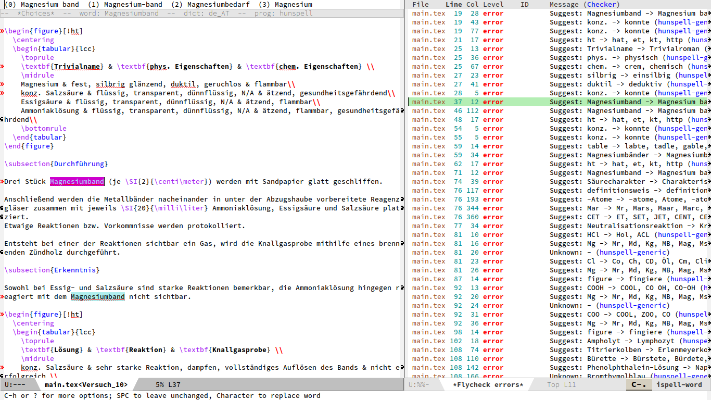

Note: this file is auto converted from flycheck-hunspell.el by [el2org](https://github.com/tumashu/el2org), please do not edit it by hand!!!

- [flyspell-hunspell](#org9a75fbd)
  - [Installation](#org9d11b18)
  - [Configuration](#org97813e1)


<a id="org9a75fbd"></a>

# flyspell-hunspell



This package adds support for spell checking to flycheck using the [hunspell](https://hunspell.github.io) command line interface.

In particular it (ab)uses its "-u1" flag which provides a ispell-like (though not 100% compatible) communication format that can be parsed.

The package currently defines checkers for TeX, nroff/troff/groff, HTML, XML and plain text files with dynamic languages (based on the ispell-local-dictionary). There is also a static de<sub>AT</sub> TeX checker for debugging purposes. This is done because the author of this package pefers it for their workflow.


<a id="org9d11b18"></a>

## Installation

I recommend using [straight.el](https://github.com/raxod502/straight.el) for installing non-(m)elpa sources.

```elisp
(use-package flycheck-hunspell
  :straight (flycheck-hunspell :type git :host github
                      :repo "leotaku/flycheck-hunspell")
  :after flycheck)
```

You of course also need to install the `hunspell` binary. Most major linux distributions package it and there's probably a working macport.


<a id="org97813e1"></a>

## Configuration

Enable your preferred checkers by adding them to `flycheck-checkers` like so:

```elisp
(add-to-list 'flycheck-checkers 'tex-hunspell-dynamic)
```

You may also want to automatically enable flycheck for TeX or any other mode.

```elisp
(add-hook 'your-mode-hook 'flycheck-mode)
```

For steamless ispell integration, I recommend setting the following variables:

```elisp
(setq ispell-dictionary "some_dictionary"
     ispell-program-name "hunspell"
    ispell-really-hunspell t
    ispell-silently-savep t)
```

You may also want to advice \`ispell-pdict-save\` for instant feedback when inserting new entries into your local dictionary:

```elisp
(advice-add 'ispell-pdict-save :after 'flyspell-recheck)
(defun flyspell-recheck (_)
  (when (bound-and-true-p flycheck-mode)
   (flycheck-buffer))
```
